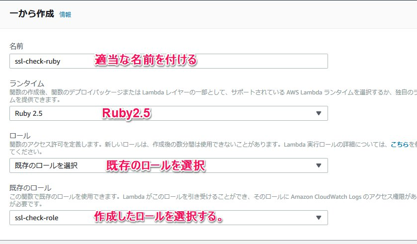
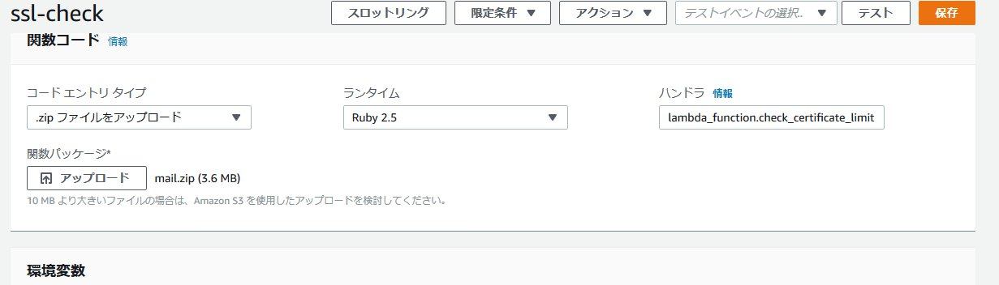
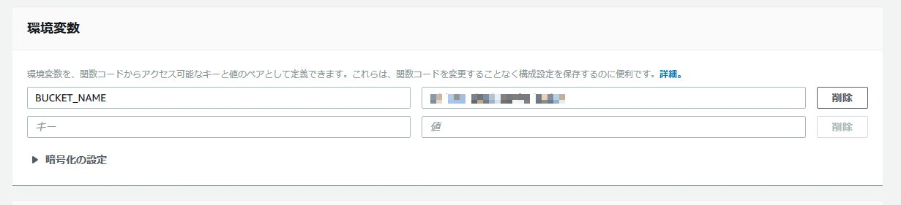

AWS Lambda のRuby対応テスト
===
AWSのLambdaがRuby対応したので、ClodWatchEventと連携して、SSL証明書の期限をチェックするプログラムを書いてみました。

SSL証明書の期限が30,15,7,3,1前に警告メールを送ります。

開発環境
* windows10
* ruby 2.5.3p105 (2018-10-18 revision 65156) [x64-mingw32]
* VisualStudioCode 

必要なもの
----
* SES
* S3
* Lambda for Ruby
* CloudWatchEvent

使い方
----
1. 適当なS3バケットを作成し、その中にchk_ssl_limit_hosts.ymlファイルをアップロードします。  
設定は見ればわかると思いますが、SSL証明書をチェックするURLと通知先メールアドレスです。  
SESがテストモードの場合は、許可されたメールアドレスをセットしてください。
1. ロールを作成します。
  セットするロールはS3の参照権限とSESの送信権限があればOKです。
    ```
    {
        "Version": "2012-10-17",
        "Statement": [
            {
                "Sid": "VisualEditor0",
                "Effect": "Allow",
                "Action": "s3:GetObject",
                "Resource": "arn:aws:s3:::<設定を置いたS3バケット名>/*"
            },
            {
                "Sid": "VisualEditor1",
                "Effect": "Allow",
                "Action": "ses:SendEmail",
                "Resource": "*"
            }
        ]
    }
    ```
1. SESが利用可能でない場合は、設定します。バージニア以外に作った場合はソース中のリージョン指定を変更する必要があります。
1. ラムダは、１から作成を選択して、Rubyを選びます。ロールの選択は既存のロールを選択するようにし、作成したロールを指定します。

本ソースをチェックアウト後、
	```
	bundle install --path vendor/bundle
	```
	を実行し、必要なGem一式をそろえます。
	その後、.bundle、lambda_function.rb、mail.erb、vendorをZip圧縮します。
	zip圧縮したファイルをアップロードします。この時にハンドラを```file_name.function_name```に合わせないといけないようです。
	
1. 環境変数も設定します。
    
1. タイムアウトの設定は監視するホスト数によりますが、最初のrequireが結構かかるので、（２回目以降はキャッシュが利いて早くなります）１分以上にセットするほうがよさそうです。  
サーバ側が応答を返さない（ファイヤーウォールなどでブロックされている等)の場合、lambdaのほうが先にタイムアウトする場合があります。その場合監視対象から除外してください。そもそも監視できませんし。
1. CloudWatchEvent
[この辺り](https://bit.ly/2EDhlM2)を参考に設定します。


